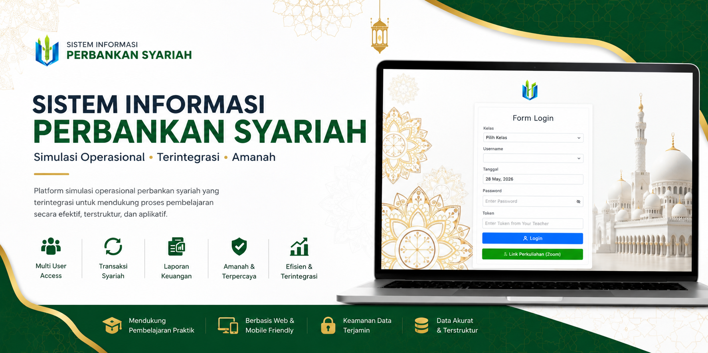
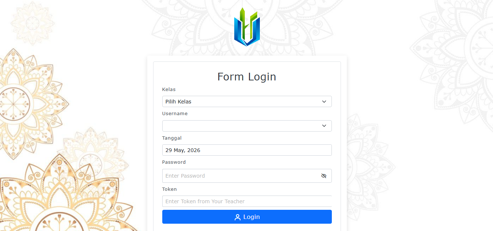
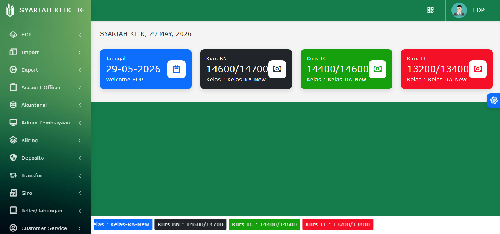
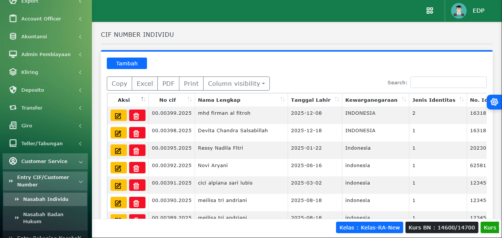

# Bank Syariah Management System
   

  

Aplikasi ini merupakan **showcase / demo project** yang digunakan untuk portofolio.  
Beberapa data dan fitur mungkin tidak sepenuhnya lengkap atau disederhanakan untuk kebutuhan portofolio.

Sistem informasi perbankan syariah berbasis web yang dirancang untuk mendukung proses pembelajaran operasional perbankan syariah secara terintegrasi, modern, dan aplikatif. Sistem ini dikembangkan sebagai media simulasi praktik perbankan bagi mahasiswa, dosen, maupun laboran agar proses pembelajaran tidak hanya bersifat teoritis tetapi juga memberikan pengalaman operasional yang menyerupai dunia kerja nyata.

---

## Tentang Project

Bank Syariah Management System membantu proses simulasi berbagai aktivitas operasional perbankan syariah seperti pembukaan rekening tabungan syariah, pengelolaan pembiayaan, transaksi bagi hasil, pengelolaan deposito syariah, pencatatan jurnal transaksi berbasis akad syariah, hingga penyusunan laporan keuangan syariah. Sistem ini dirancang untuk mendukung kegiatan laboratorium perbankan syariah agar proses pembelajaran menjadi lebih efektif, terstruktur, dan fleksibel sesuai prinsip-prinsip syariah.

Selain digunakan sebagai media pembelajaran, sistem ini juga mendukung pengelolaan administrasi laboratorium perbankan syariah melalui pengaturan hak akses pengguna, monitoring aktivitas praktikum, serta integrasi data pembelajaran dalam satu platform terpusat. Dengan adanya sistem ini, proses simulasi dan praktik perbankan syariah dapat dilakukan secara lebih modern, efisien, dan mendukung pemahaman mahasiswa terhadap implementasi operasional bank syariah di dunia nyata.

---

## Fitur Utama

* Manajemen data nasabah
* Pembukaan rekening tabungan syariah
* Transaksi setoran dan penarikan tunai
* Simulasi transfer antar rekening
* Pengelolaan deposito syariah
* Pengelolaan pembiayaan syariah
* Simulasi akad murabahah, mudharabah, dan musyarakah
* Jurnal transaksi keuangan syariah
* Laporan saldo harian nasabah
* Laporan posisi keuangan syariah
* Monitoring transaksi pembiayaan
* Manajemen hak akses pengguna
* Simulasi pembiayaan bank syariah
* Riwayat transaksi nasabah
* Cetak laporan transaksi dan pembiayaan
* dll

---

## Teknologi yang Digunakan

* PHP
* Laravel Framework
* MySQL
* Bootstrap
* JavaScript

---

## Screenshot

### Login Page

  

### Dashboard

  

### CIF

  

---

## Role Play

* Administrator
* Account Officer
* Admin Kredit
* Akuntansi
* Customer Service
* Deposito
* EDP
* Export Import
* Giro
* Kliring
* Teller
* Transfer
  
---
## Status

Project aktif dikembangkan untuk kebutuhan simulasi laboratorium perbankan syariah.
